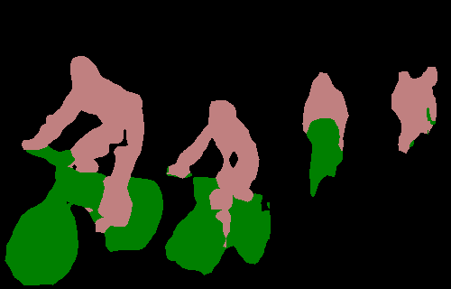
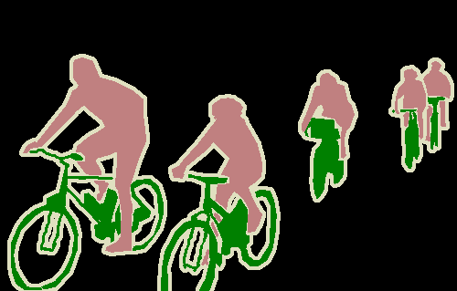
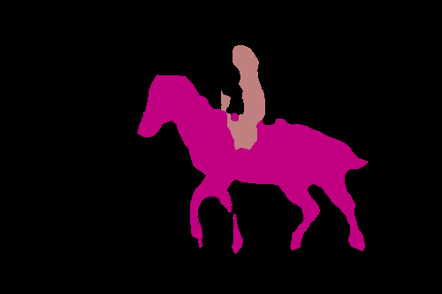
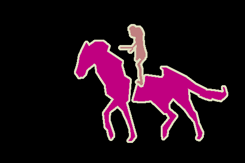
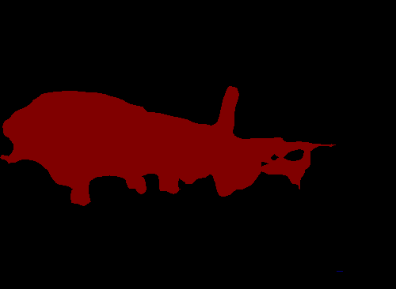
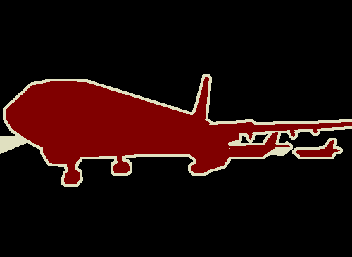
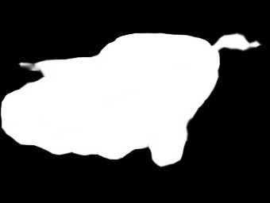
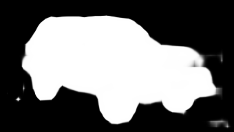
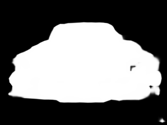

Keras-FCN
---------

The original work is from [here] (https://github.com/aurora95/Keras-FCN)
Modify the original `FCN_Vgg_32s` to `FCN_Vgg_8s` and futher use `FCN_Vgg_8s` to implement unsupervised single-class co-segmentation.


## Models

Models are found in [models.py](models.py). Use `FCN_Vgg_8s` to train on augmented Pascal VOC2012 dataset (11355 training images),and validate on Pascal VOC2012 validation set(1449 images), with pixel mean Intersection over Union `mIoU 0.5856`, and pixel accuracy around `0.89`.














```

## Datasets

# Manual Pascal VOC Download (not required)

    # original PASCAL VOC 2012
    wget http://host.robots.ox.ac.uk/pascal/VOC/voc2012/VOCtrainval_11-May-2012.tar # 2 GB
    # berkeley augmented Pascal VOC
    wget http://www.eecs.berkeley.edu/Research/Projects/CS/vision/grouping/semantic_contours/benchmark.tgz # 1.3 GB
```


## Co-attention CNNs for Unsupervised Object Co-segmentation
Implementation for [IJCAI2018 paper] (https://www.ijcai.org/proceedings/2018/104)
Use ground truth to first check if it works well. 
Currently the results of unsupervised training haven't reached to our expectation. Will soon update the code and results without ground truth.










# Run training
python train.py
```
- Generator.py 
  modified from SegDataGenerator.py for reading the sub-internet dataset images.
- DataGenerator.py
  just slight changes from SegDataGenerator.py. (import this one if just want to train fcn on pascal VOC dataset)
```

# Evaluate the performance of the network
python evaluate.py


